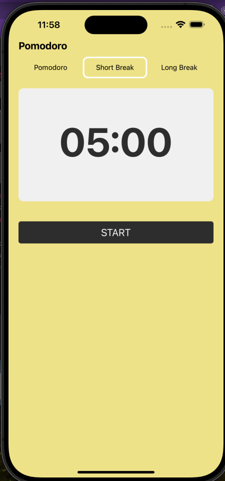

# Proyecto de React Native

Este es un proyecto de ejemplo de una aplicación móvil desarrollada con React Native.



## Requisitos previos

Asegúrate de tener instalado Node.js y npm en tu sistema.

## Instalación

1. Clona este repositorio en tu máquina local.
2. Navega hasta el directorio del proyecto.
3. Ejecuta el siguiente comando para instalar las dependencias:

```bash
npm install
```

## Uso

1. Ejecuta el siguiente comando para iniciar la aplicación en un emulador o dispositivo conectado:

```bash
npm start
```

2. Sigue las instrucciones en la consola para seleccionar el emulador o dispositivo deseado.

## Licencia

Este proyecto está bajo la Licencia MIT. Consulta el archivo [LICENSE](./LICENSE) para más detalles.
